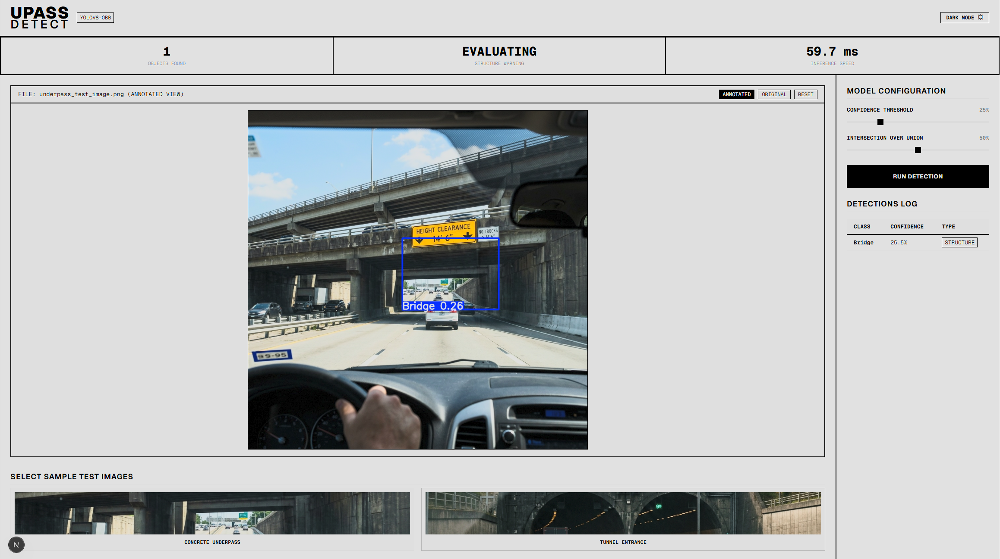

# UPASS DETECT [OBB]

UPASS DETECT is a high-contrast, brutalist-inspired real-time underpass clearance and safety detection dashboard. Powered by a fine-tuned **YOLOv8-OBB (Oriented Bounding Box)** computer vision model, it identifies bridges, height signs, warning barriers, and tunnels to evaluate collision risk for tall vehicles.



---

## 1. Under the Hood: How It Works

The application operates as a distributed frontend-backend system:

### The Backend (FastAPI / Python)
* **Model Inference**: The backend ([server.py](server.py)) loads a custom-trained **YOLOv8n-OBB** model weight file ([best.pt](runs/obb/rot15_augmented10/weights/best.pt)).
* **Oriented Bounding Boxes (OBB)**: Traditional object detection uses horizontal boxes (`xyxy`). UPASS DETECT uses oriented bounding boxes (`xyxyxyxy` representing 4 corners), allowing the boxes to rotate and align precisely with tilted bridges, overhead signs, and angled tunnel entrances. This yields highly accurate spatial geometry.
* **REST API**: Exposes a `/api/detect` endpoint that validates uploaded images, runs inference using PyTorch/Ultralytics, renders predicted rotated boxes on the canvas, and returns base64-encoded annotated images alongside a detections JSON payload.

### The Frontend (Next.js / TypeScript)
* **Brutalist Dashboard**: Built as a responsive single-page web app in [page.tsx](src/app/page.tsx). It uses a clean, high-contrast monochrome aesthetic that fits modern industrial and diagnostic tooling.
* **API Proxying**: Next.js redirects all requests hitting `/api/*` to the Python server running at `http://127.0.0.1:8008` as configured in [next.config.ts](next.config.ts).
* **Dynamic Sizing & Dark Mode**: Resizes fluidly to fit any screen resolution (`100vh`) with scrollable image containers. Features a manual light/dark theme switch that preserves user preference.

---

## 2. Screenshot Analysis: What's in the Image?

The screenshot `screenshots/1.png` captures the dashboard in action:
* **The Visual Input**: A driver's perspective photo of a highway underpass. In the center, a yellow height clearance warning sign reads `HEIGHT CLEARANCE 14' 6"`.
* **Live Detection**: The YOLOv8-OBB model has identified the concrete underpass structure, drawing a rotated blue oriented bounding box labeled **`Bridge 0.26`** around the bridge opening.
* **Stats Summary Bar**:
  * **Objects Found (1)**: Tracks the number of active safety objects detected.
  * **Structure Warning (EVALUATING)**: Triggers an warning state because a bridge/structure was resolved in the path, prompting clearance evaluations.
  * **Inference Speed (59.7 ms)**: High-speed execution time for image processing, model run, and postprocessing.
* **Sidebar Logs**: Displays the raw detection table outlining the class (`Bridge`), the exact confidence score (`25.5%`), and the category (`STRUCTURE`).
* **Interactive Samples**: Shows the test selection grid at the bottom loaded with **Concrete Underpass** and **Tunnel Entrance** test cases.

---

## 3. Key Model Configuration Concepts

The sidebar allows you to fine-tune model parameters dynamically using sliders:

### A. Confidence Threshold
The probability score (from 0% to 100%) above which the model classifies a detection as a real object.
* **In the Screenshot**: The threshold is set to **`25%`**. The bridge was detected with **`25.5%`** confidence, so it barely cleared the filter and is shown.
* **Effect of Adjustment**:
  * **Higher Threshold (e.g., 50%)**: Reduces false positives. The model will only display objects it is highly certain about. (Adjusting it to 30% in this screenshot would hide the bridge).
  * **Lower Threshold (e.g., 10%)**: Displays more objects but increases false alarms/noise.

### B. Intersection Over Union (IoU)
An evaluation metric measuring how much two bounding boxes overlap. It is defined as:

$$\text{IoU} = \frac{\text{Area of Overlap}}{\text{Area of Union}}$$

* **Non-Maximum Suppression (NMS)**: When a model makes predictions, it often outputs multiple duplicate bounding boxes around the *same* physical object. 
* **Effect of Adjustment**:
  * The **IoU Threshold** (set to **`50%`** in the screenshot) decides when to merge these duplicates. If two boxes overlap by more than 50%, the system merges them, keeping only the highest-confidence box.
  * **High IoU (e.g., 80%)**: Overlapping boxes must match almost perfectly to merge. Setting this too high can cause duplicate, double-drawn outlines on the same object.
  * **Low IoU (e.g., 20%)**: Boxes merge aggressively. Setting this too low might cause the model to mistakenly delete a valid neighboring object if it lies close to another.

---

## 4. How to Run the App Locally

### Prerequisites
* **Python 3.10+** (with CUDA toolkit installed for GPU acceleration if available)
* **Node.js 18+** & `npm`

### 1. Launch the Backend Server
Initialize your Python environment, install dependencies, and run the FastAPI server:
```bash
# Set up virtual environment
python -m venv .venv
source .venv/bin/activate  # On Windows: .venv\Scripts\activate

# Install requirements
pip install -r requirements.txt

# Start FastAPI
python server.py
```

### 2. Launch the Next.js Frontend
In a new terminal window, compile the frontend assets and run the concurrent development script:
```bash
npm install
npm run dev
```

Open **[http://localhost:3000](http://localhost:3000)** in your browser to interact with the system.
